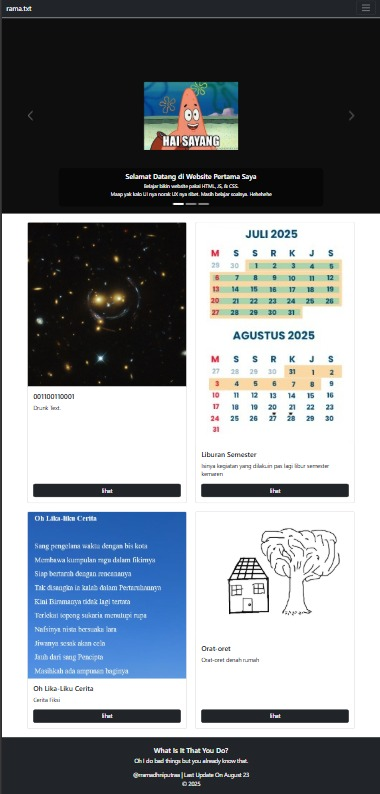

 
 

# 🐦‍⬛ Hello World !
by **rramadhniputraa**
<br>[](https://github.com/rramadhniputraaaaa)
[](mailto:pipelofnamex@gmail.com.id)
[](https://x.com/mantapdigital)
[](https://www.instagram.com/rramadhniputraa/?utm_source=ig_web_button_share_sheet)
[](https://www.linkedin.com/in/tiorizkyramadhaniputra/)
[](https://www.youtube.com/@uglyboy6784)



<br>[](https://rramadhniputraaaaa.github.io/-Haiii/?fbclid=PAZXh0bgNhZW0CMTEAAadQaERfdb2U-hp0fGNcGaKWkNtf0xEz-M1xd6b8ShadvroyvtNaaUzblZ1Uig_aem_F8Tz1XgSDZ881xtiQReLMg)

Ini adalah Kali pertama saya belajar tentang web developer. adapun saya mulai belajar karena mengikuti pelatihan dari kemkomdigi. Selain itu, saya juga banyak belajar dari Mas Dea Afrizal. Website ini dibuat tidak untuk tujuan akademik, melainkan untuk kepentingan pribadi. Hanya untuk bersenang-senang dan mengutarakan apa yang ingin disampaikan atau mengaplikasikan hal-hal yang baru dipelajari dan didapatkan terkait dunia web developer (HTML, CSS, dan JavaScript). 

## Fitur :
🐵 Hello, World! 
<br>🐱 Katalog Produk
<br>🐻‍❄️ Misuh
<br>🐔 Madang
<br>🦎 Movie
<br>🐴 Marathon
<br>🦖 Recommended 4u

## Content :
📑 Drunk Text
<br>🏖️ Liburan Semester
<br>❄️ Oh Lika-liku Cerita
<br>🏠 Orat-oret 

## Persyaratan Pengguna 
- **Browser** Modern (Chrome, Firefox, Edge, Safari)
- **Dewasa** Tidak memasak mie saat dirumah banyak lauk
- **Baligh** Hafal Niat Mandi Wajib

## Instalasi 💾

Ikuti langkah-langkah berikut untuk menjalankan website ini secara lokal:

### 1. Clone Repository
```bash
git clone https://github.com/rramadhniputraaaaa/-Haiii
cd -Haiii
```


## 📂 Struktur Direktori

```plaintext
project-web/                     # 🌐 Root project folder
│
├── 📄 index.html                 # 🏠 Halaman utama (entry point)
├── 📄 HI.html                    # ℹ️  Halaman tambahan
│
├── 📂 Main Pages                 # ⚡ Kumpulan halaman utama
│   ├── 📄 Main.html              # 🔑 Halaman utama fitur
│   ├── 📄 Main1.html             # 1️⃣ Halaman fitur 1
│   ├── 📄 Main2.html             # 2️⃣ Halaman fitur 2
│   ├── 📄 Main3.html             # 3️⃣ Halaman fitur 3
│   └── 📄 FIXMAIN.HTML           # 🛠️  Versi fix halaman utama
│
├── 📂 Cerita                     # 📚 Kumpulan cerita
│   ├── 📄 cerita1.html           # 📖 Cerita 1
│   ├── 📄 cerita2.html           # 📖 Cerita 2
│   └── 📄 cerita3.html           # 📖 Cerita 3
│
├── 📂 Halaman Tambahan           # 🗂️  Konten tambahan
│   ├── 📄 Libur.html             # 🎉 Halaman liburan
│   ├── 📄 katalog.html           # 🛍️  Katalog produk
│   ├── 📄 KALENDER-AKADEMIK.html # 📅 Kalender akademik
│   ├── 📄 DESKKAKROS.html        # 📝 Desk Kakros
│   ├── 📄 omah-1.html            # 🏡 Omah versi 1
│   └── 📄 omah1.html             # 🏡 Omah versi 2
│
└── 📄 readme.md                  # 📘 Dokumentasi project
```

## 🛠️ Cara Penggunaan

Setelah instalasi berhasil, ikuti langkah berikut untuk menggunakan website ini:

1. **Buka Halaman Utama**
   - Jalankan file `index.html` di browser modern (Chrome, Firefox, Edge, Safari).
   - Kamu akan masuk ke halaman depan website.

2. **Navigasi Halaman**
   - Gunakan tombol navigasi atau link yang tersedia untuk berpindah antar halaman:
     - `Main.html`, `Main1.html`, `Main2.html`, `Main3.html` → halaman utama fitur.
     - `cerita1.html`, `cerita2.html`, `cerita3.html` → kumpulan cerita.
     - `Libur.html`, `katalog.html`, `KALENDER-AKADEMIK.html` → konten tambahan.

3. **Fitur Input NIU**
   - Masukkan angka pada kolom input (contoh: `******`).
   - Jika benar → otomatis diarahkan ke halaman `Main3.html`.
   - Jika salah → muncul pesan *"salah wkwkwk"*.

4. **Katalog & Konten**
   - Buka `katalog.html` untuk melihat daftar produk.
   - Halaman `cerita*.html` berisi cerita/teks hiburan.
   - `Libur.html` dan `KALENDER-AKADEMIK.html` untuk informasi tambahan.

5. **Kustomisasi Tampilan**
   - Styling default menggunakan **Bootstrap 5.3.7 (CDN)**.
   - Kamu bisa ubah tampilan di `Style.css`.

⚡ Tips:
- Gunakan **server lokal** (misalnya `python -m http.server`) agar semua link antar halaman berjalan lancar.
- Semua halaman bisa dibuka langsung dengan double-click di file `.html`.
## 💻 Cuplikan Kode

Berikut salah satu contoh fungsi JavaScript untuk validasi input NIU:

```html
<script>
    function checkNIU() {
        const input = document.getElementById("niuInput").value;
        if (input === "******") {
            window.location.href = "Main3.html"; // kalau benar, pindah halaman
        } else {
            alert("salah wkwkwk");
        }
    }
</script>
```
``` CSS

.cerita {
  font-family: Arial, sans-serif;  /* font Arial */
  font-size: 12pt;                /* ukuran 12pt */
  text-align: justify;            /* rata kanan kiri */
  line-height: 1.0;               /* spasi 1.5 */
  margin-bottom: 1.5em;           /* jarak antar paragraf */
}
.carousel-caption {
  background: rgba(0, 0, 0, 0.5); /* transparan hitam */
  padding: 10px;
  border-radius: 10px;
  font-size: 14px; /* agak kecil di HP */
}
```
``` JS
function saklar() {
    let toggle1 = document.getElementById("default-toggle1");
    // Lampu 1
    if (toggle1.checked) {
        lampu1.src = "on.gif";
    } else {
        lampu1.src = "off.gif";
    }
}
```
## 🗺️ Roadmap Pengembangan

Website ini masih dalam tahap pengembangan. Berikut rencana ke depan berdasarkan fitur yang sudah ada:

- [x] **Versi Awal**
  - Halaman utama (`index.html`) ✅
  - Halaman fitur utama (`Main.html`, `Main1.html`, `Main2.html`, `Main3.html`) ✅
  - Halaman konten cerita (`cerita1.html`, `cerita2.html`, `cerita3.html`) ✅
  - Halaman tambahan: katalog, libur, kalender akademik ✅
  - Fitur input NIU → redirect ke `Main3.html` ✅
  - Saklar lampu sederhana dengan JS ✅

- [ ] **Penyempurnaan Navigasi**
  - Konsistensi navbar & footer di semua halaman
  - Tambah breadcrumb agar lebih mudah menjelajahi
  - Tombol back-to-top di halaman panjang

- [ ] **Interaktivitas**
  - Perbaikan script **saklar** agar bisa kontrol lebih dari 1 lampu
  - Validasi input NIU dengan pesan error lebih informatif
  - Tambah form kontak sederhana (nama, email, pesan)

- [ ] **Konten**
  - Lengkapi halaman `katalog.html` dengan daftar produk + gambar
  - Halaman `Libur.html` → ditambah kalender event liburan interaktif
  - Halaman `cerita*.html` → pagination / navigasi antar cerita
  - Tambah galeri gambar (carousel Bootstrap)

- [ ] **UI/UX**
  - Optimisasi tampilan mobile (responsif penuh)
  - Gunakan card/grid layout untuk konten
  - Tambah animasi hover & transisi smooth

- [ ] **Optimisasi Teknis**
  - Pisahkan `CSS` dan `JS` ke folder `assets/`
  - Minify CSS & JS
  - Optimisasi gambar (kompres ukuran tanpa hilang kualitas)

- [ ] **Deployment**
  - Hosting ke GitHub Pages / Netlify
  - Tambah custom domain (opsional)
  - Dokumentasi lengkap cara penggunaan & fitur di README


## 📜 Lisensi

🚫 Jangan serius serius, cuma buat belajar dan lucu lucuan aja.  
💻 Silakan *copas*, *remix*, *edit-edit* sesuka hati.  
🍜 Asal jangan lupa traktir mie ayam kalau ketemu yak.  
⚡ Selalu always Mencintai my true love Ms. GPT.  

Singkatnya:  
- Boleh dipakai ✅  
- Boleh dimodifikasi ✅  
- Boleh disebar ✅  
- Gak boleh dijual mahal-mahal ❌ (eh emang bisa dijual yak?)  

---
© 2025 — Dibuat sambil nyusu 🥛🐄 dan begadang 🌙
